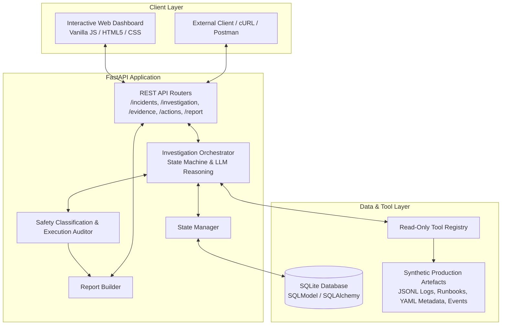
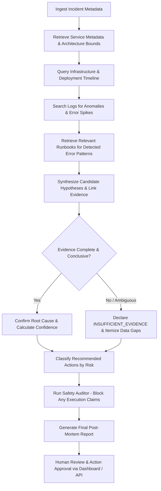

# Incident Investigation Agent

An AI-assisted incident investigation and decision-support system for site reliability and engineering operations teams. The application autonomously investigates controlled production incidents by querying read-only diagnostic telemetry, correlating multi-source evidence, formulating and testing competing hypotheses, strictly enforcing uncertainty when data is ambiguous, and generating structured post-mortem reports—while enforcing hard safety boundaries that keep humans firmly in control.

> **Safety Notice**: This system operates strictly as an **investigation and decision-support assistant**, NOT an autonomous remediation agent. It cannot execute live infrastructure changes. High-risk operational actions are categorized and require explicit human authorization; approval endpoints record authorization decisions only.

---

## Table of Contents

- [Problem Statement](#problem-statement)
- [Objectives](#objectives)
- [Key Features](#key-features)
- [System Architecture](#system-architecture)
- [Investigation Workflow](#investigation-workflow)
- [Technology Stack](#technology-stack)
- [Project Directory Structure](#project-directory-structure)
- [Installation & Setup](#installation--setup)
- [Environment Configuration](#environment-configuration)
- [Running the Application](#running-the-application)
- [Interactive Dashboard](#interactive-dashboard)
- [API Endpoints](#api-endpoints)
- [Automated Testing & Results](#automated-testing--results)
- [Safety Controls & Guardrails](#safety-controls--guardrails)
- [Specification-Driven Development](#specification-driven-development)
- [Limitations & Future Enhancements](#limitations--future-enhancements)
- [Author](#author)

---

## Problem Statement

During production outages and latency spikes, on-call engineers face high cognitive load while correlating disparate, asynchronous telemetry sources under tight time constraints:
- Application, gateway, and database client logs
- Service metadata, architecture bounds, and dependency topologies
- Infrastructure deployment events, canary rollouts, and scheduled batch jobs
- Operational runbooks and remediation protocols

Under pressure, teams frequently fall prey to cognitive biases: anchoring on recent deployments that were actually benign, ignoring downstream cascading effects, or attempting high-risk remediation actions without traceable evidence.

---

## Objectives

1. **Automate Evidence Collection**: Systematically query logs, runbooks, service metadata, and deployment timelines without human toil.
2. **Eliminate Fabrication & Hallucination**: Every root-cause claim must link directly to verifiable raw evidence IDs (`EVD-xxx`).
3. **Explicitly Surface Uncertainty**: When evidence is incomplete, conflicting, or inconclusive, classify the outcome as `INSUFFICIENT_EVIDENCE` rather than guessing.
4. **Enforce Safety & Separation of Powers**: Provide read-only diagnostic capability with zero production write access; require explicit human authorization for all operational suggestions.
5. **Standardize Post-Mortem Reporting**: Generate comprehensive, structured JSON reports capturing timelines, evaluated hypotheses, confidence metrics, and next steps.

---

## Key Features

- **Evidence-First Root Cause Analysis**: Evaluates hypotheses against collected telemetry; requires explicit `supporting_evidence_ids` and tracks `contradicting_evidence_ids`.
- **Honest Uncertainty Handling (`INSUFFICIENT_EVIDENCE`)**: Recognizes missing logs or unconfirmed causal chains (demonstrated in `INC-002`) and flags explicit data gaps instead of hallucinating.
- **Read-Only Tool Registry**: Interrogates system state strictly via sandboxed diagnostic tools:
  - `search_logs`: Filter logs by timestamp, severity, and keyword regex across microservices.
  - `get_service_metadata`: Fetch operational dependencies, connection limits, and SLAs.
  - `get_deployment_events`: Inspect version releases and background job schedules.
  - `get_runbook`: Retrieve official operational runbooks and mitigation strategies.
- **Strict Safety Audit Layer**:
  - Scans model responses for forbidden execution claims (e.g., *"I restarted the service"* triggers `SafetyViolationError`).
  - Classifies recommendations into 4 tiers: `READ_ONLY_DIAGNOSTIC`, `LOW_RISK_OPERATIONAL`, `HIGH_RISK_OPERATIONAL`, and `DESTRUCTIVE`.
  - Flags high-risk operations with `requires_approval=True`.
- **Modern Interactive Dashboard**: Single-page web application featuring real-time investigation progress, interactive tool logs, hypothesis confidence gauges, and human approval toggles.
- **Robust Persistence**: SQLite database using SQLModel (SQLAlchemy 2.0 + Pydantic v2) for reliable state tracking and decision auditing.

---

## System Architecture



---

## Investigation Workflow

The agent follows an iterative, hypothesis-testing lifecycle:



---

## Technology Stack

| Layer | Technology | Purpose |
| :--- | :--- | :--- |
| **Backend Framework** | **FastAPI** `0.111.0` | High-performance asynchronous REST API framework |
| **ASGI Server** | **Uvicorn** `0.29.0` | Production ASGI web server |
| **Data Persistence** | **SQLModel** `0.0.19` / **SQLAlchemy** | Type-safe ORM combining SQLAlchemy with Pydantic |
| **Data Validation** | **Pydantic** `2.7.1` | Request/response validation and strict schema enforcement |
| **HTTP Client** | **HTTPX** `0.27.0` | Async HTTP client for external integrations |
| **Configuration** | **python-dotenv** `1.0.1` | Environment variable parsing from `.env` |
| **File Formats** | **PyYAML** `>=6.0`, `json`, `jsonl` | Reading configuration metadata, logs, and telemetry |
| **Database** | **SQLite 3** | Embedded zero-configuration persistence |
| **Frontend UI** | **HTML5 / Modern CSS / Vanilla JS** | Lightweight, responsive single-page operator dashboard |
| **Automated Testing** | **Pytest** `8.2.0`, **pytest-asyncio** `0.23.7`, **AnyIO** `4.4.0` | Comprehensive test runner and async test execution |

---

## Project Directory Structure

```
incident-investigation-agent/
├── app/
│   ├── agent/                      # Core agent reasoning & governance
│   │   ├── orchestrator.py         # Multi-step investigation loop & tool caller
│   │   ├── report_builder.py       # Post-mortem structured report generator
│   │   ├── safety.py               # Safety classifier & execution claim auditor
│   │   └── state_manager.py        # Investigation state lifecycle & audit trail
│   ├── models/                     # SQLModel & Pydantic schemas
│   │   ├── incident.py             # Incident database models & DTOs
│   │   └── state.py                # Evidence, hypothesis, action & report schemas
│   ├── routers/                    # FastAPI route handlers
│   │   ├── actions.py              # Operational action recommendations & approvals
│   │   ├── evidence.py             # Evidence items and candidate hypotheses
│   │   ├── incidents.py            # Incident creation and listing
│   │   ├── investigation.py        # Trigger & poll investigation status
│   │   └── report.py               # Final report retrieval
│   ├── static/                     # Web dashboard frontend
│   │   └── index.html              # Single-page interactive operator UI
│   ├── tools/                      # Sandboxed read-only diagnostic tools
│   │   ├── deployment.py           # Deployment & scheduled job queries
│   │   ├── log_search.py           # Multi-service JSONL log filtering
│   │   ├── metadata.py             # Service architecture & dependency lookup
│   │   └── runbook.py              # Operational runbook markdown reader
│   ├── db.py                       # SQLModel database engine & table initializer
│   └── main.py                     # FastAPI application entrypoint & static mounts
├── artefacts/                      # Synthetic incident triage telemetry
│   ├── incidents/                  # Incident definitions (INC-001, INC-002)
│   ├── logs/                       # JSONL logs (api_gateway, db_client, order_service, etc.)
│   ├── runbooks/                   # Markdown runbooks (db_connection_pool, http_503, etc.)
│   ├── tool_contracts/             # JSON schema tool contracts
│   ├── infrastructure_events.json  # Timeline of deployments and scheduled batch jobs
│   └── service_metadata.yaml       # Microservice metadata & resource limits
├── docs/                           # Architectural & API specifications
│   ├── agent_workflow.md           # Step-by-step agent lifecycle documentation
│   ├── api_documentation.md        # Comprehensive REST API reference
│   ├── report_INC-001.json         # Reference completed report for INC-001
│   ├── report_INC-002.json         # Reference completed report for INC-002
│   ├── safety_controls.md          # Safety matrix & execution audit rules
│   ├── specification_workflow.md   # Spec-driven development methodology
│   ├── state_schema.md             # State machine & data contract definitions
│   └── tool_definitions.md         # Diagnostic tool inputs and outputs
├── tests/                          # Automated Pytest test suite (105 tests)
│   ├── conftest.py                 # Test fixtures, mock databases & test client
│   ├── test_action_executed.py     # Execution prevention & claim rejection tests
│   ├── test_api_endpoints.py       # FastAPI endpoint tests
│   ├── test_conflicting.py         # Conflicting evidence resolution tests
│   ├── test_e2e_validation.py      # End-to-end incident investigation validation
│   ├── test_high_risk_action.py    # Risk classification & approval requirement tests
│   ├── test_insufficient.py        # INSUFFICIENT_EVIDENCE edge case handling tests
│   ├── test_log_empty.py           # Empty log handling tests
│   ├── test_malformed.py           # Malformed input resilience tests
│   ├── test_runbook_missing.py     # Missing runbook fallback tests
│   ├── test_scenarios_1to20.py     # 20 specification scenario tests
│   ├── test_timeout.py             # Diagnostic tool timeout tests
│   ├── test_tools.py               # Unit tests for read-only tools
│   └── test_unsupported_cause.py   # Unsupported cause handling tests
├── .env.example                    # Template environment variables
├── .gitignore                      # Git exclusion rules
├── requirements.txt                # Production and test dependencies
└── README.md                       # Project documentation
```

---

## Installation & Setup

### Prerequisites

- **Python 3.12** or higher
- **Git**

### 1. Clone the Repository

```bash
git clone https://github.com/smsanjana/incident-investigation-agent.git
cd incident-investigation-agent
```

### 2. Create and Activate a Virtual Environment

**On Linux/macOS:**
```bash
python3 -m venv venv
source venv/bin/activate
```

**On Windows (PowerShell):**
```powershell
python -m venv venv
.\venv\Scripts\Activate.ps1
```

### 3. Install Dependencies

```bash
pip install --upgrade pip
pip install -r requirements.txt
```

---

## Environment Configuration

Create a `.env` file in the root directory by copying `.env.example`:

```bash
cp .env.example .env
```

Configure your environment settings (placeholder defaults work out of the box for synthetic evaluation):

```dotenv
# LLM Provider Configuration
LLM_PROVIDER=openai
LLM_MODEL=gpt-4o
OPENAI_API_KEY=your-openai-api-key-here

# Optional: Google Gemini
# LLM_PROVIDER=gemini
# LLM_MODEL=gemini/gemini-1.5-pro
# GEMINI_API_KEY=your-gemini-api-key-here

# Optional: Anthropic Claude
# LLM_PROVIDER=anthropic
# LLM_MODEL=claude-3-5-sonnet-20241022
# ANTHROPIC_API_KEY=your-anthropic-api-key-here

# Application Configuration
DATABASE_URL=sqlite:///./incident_agent.db
ARTEFACTS_DIR=./artefacts
LOG_SEARCH_TIMEOUT_SECONDS=30
MAX_INVESTIGATION_ITERATIONS=15
DEBUG=false
```

---

## Running the Application

Start the backend server using Uvicorn:

```bash
uvicorn app.main:app --host 0.0.0.0 --port 8000 --reload
```

The service will start at `http://localhost:8000`.

- **Interactive UI Dashboard**: [http://localhost:8000](http://localhost:8000)
- **Interactive Swagger API Docs**: [http://localhost:8000/docs](http://localhost:8000/docs)
- **ReDoc Alternative API Docs**: [http://localhost:8000/redoc](http://localhost:8000/redoc)
- **Health Check Endpoint**: [http://localhost:8000/health](http://localhost:8000/health)

---

## Interactive Dashboard

The application includes an embedded operator dashboard accessible at `http://localhost:8000`:

1. **Incident Selection**: Choose an existing incident (`INC-001`, `INC-002`) or register a new one.
2. **Investigation Trigger**: Initiate the autonomous investigation loop with a single click.
3. **Live Execution Timeline**: Monitor real-time diagnostic tool calls, parameter inputs, and raw outputs.
4. **Hypothesis Evaluation Card**: Inspect candidate hypotheses, quantitative confidence scores, supporting evidence IDs, and disproving evidence.
5. **Safety Approval Panel**: Review recommended actions categorized by risk level. Authorize high-risk operations via the approval toggle with full audit tracking.
6. **Report Export**: Inspect or download the complete post-mortem report in structured JSON format.

---

## API Endpoints

| Method | Endpoint | Description |
| :--- | :--- | :--- |
| `GET` | `/health` | Health check endpoint returning service status |
| `POST` | `/incidents` | Register a new incident with title, service, and symptoms |
| `GET` | `/incidents` | List all registered incidents |
| `GET` | `/incidents/{id}` | Retrieve details and status of a specific incident |
| `POST` | `/incidents/{id}/investigate` | Trigger the asynchronous investigation loop |
| `GET` | `/incidents/{id}/evidence` | Retrieve collected evidence items and candidate hypotheses |
| `GET` | `/incidents/{id}/actions` | List recommended remediation and diagnostic actions |
| `POST` | `/incidents/{id}/actions/{action_id}/approve` | Record human approval decision for a high-risk action |
| `GET` | `/incidents/{id}/report` | Retrieve the final structured post-mortem investigation report |

---

## Automated Testing & Results

The project includes a comprehensive automated test suite covering all functional requirements, tool contracts, safety boundaries, and edge cases.

### Run Tests

```bash
pytest -v
```

### Actual Verification Results

```
============================= test session starts =============================
platform win32 -- Python 3.12.10, pytest-8.2.0, pluggy-1.6.0
plugins: anyio-4.4.0, asyncio-0.23.7
asyncio: mode=Mode.STRICT
collected 105 items

tests\test_action_executed.py ........................                   [ 22%]
tests\test_api_endpoints.py .......                                      [ 29%]
tests\test_conflicting.py ..                                             [ 31%]
tests\test_e2e_validation.py ..                                          [ 33%]
tests\test_high_risk_action.py ................                          [ 48%]
tests\test_insufficient.py ...                                           [ 51%]
tests\test_log_empty.py ...                                              [ 54%]
tests\test_malformed.py ......                                           [ 60%]
tests\test_runbook_missing.py ....                                       [ 63%]
tests\test_scenarios_1to20.py ....................                       [ 82%]
tests\test_timeout.py ...                                                [ 85%]
tests\test_tools.py ............                                         [ 97%]
tests\test_unsupported_cause.py ...                                      [100%]

======================= 105 passed, 1 warning in 2.08s ========================
```

---

## Safety Controls & Guardrails

The agent adheres to a strict safety model defined in [`docs/safety_controls.md`](docs/safety_controls.md):

1. **Read-Only by Design**: The agent has no access to SSH keys, cloud provider mutation APIs, or Kubernetes exec credentials.
2. **Forbidden Claim Detection**: Output strings indicating execution (*"I restarted"*, *"I scaled up"*, *"I executed"*) are intercepted by `app/agent/safety.py` and immediately raise a `SafetyViolationError`.
3. **Four-Tier Action Classification**:
   - `READ_ONLY_DIAGNOSTIC` (Safe, auto-executable in triage)
   - `LOW_RISK_OPERATIONAL` (Advisory, e.g., modifying batch job schedules)
   - `HIGH_RISK_OPERATIONAL` (Requires explicit human authorization, e.g., pool resizing, service restarts)
   - `DESTRUCTIVE` (Requires explicit senior authorization, e.g., terminating database sessions)
4. **Separation of Authorization and Execution**: The `/approve` endpoint records engineer consent for auditing; actual execution remains in the hands of authorized human operators.

---

## Specification-Driven Development

This project was developed strictly adhering to the **Spec Kit Specification-Driven Development Workflow**:

$$\text{Constitution} \longrightarrow \text{Specification} \longrightarrow \text{Contracts} \longrightarrow \text{Tasks} \longrightarrow \text{Implementation} \longrightarrow \text{Automated Verification}$$

- **Constitution** (`.specify/constitution.md`): Defines 12 non-negotiable core principles (Evidence-First, No Fabrication, Explicit Uncertainty, Safety First).
- **Feature Specification** (`.specify/spec.md`): Outlines functional requirements `FR-1` through `FR-20`.
- **Data Model** (`.specify/data-model.md`): Standardizes schema contracts across runtime and persistent layers.
- **Tool Contracts** (`.specify/contracts/`): Schema definitions for tool parameters and response formats.

---

## Limitations & Future Enhancements

### Current Limitations
- **Synthetic Artefacts**: Evaluated against realistic synthetic log files and infrastructure event datasets.
- **Synchronous Diagnostic Tools**: Log search executes against local JSONL data rather than distributed Elasticsearch/OpenSearch clusters.

### Future Enhancements
- **Live Observability Connectors**: Add read-only OpenTelemetry, Datadog, and AWS CloudWatch integrations.
- **Slack & PagerDuty Webhooks**: Stream real-time investigation summaries to incident response channels.
- **Vector Runbook Search**: Hybrid BM25 and vector semantic search for large runbook knowledge bases.
- **Multi-Incident Correlation**: Cross-correlate concurrent alerts to detect systemic cascading outages.

---

## Author

**Sanjana S Marigoudar**  
GitHub: [@smsanjana](https://github.com/smsanjana)  
Email: [sanjanasmarigoudar@gmail.com](mailto:sanjanasmarigoudar@gmail.com)
