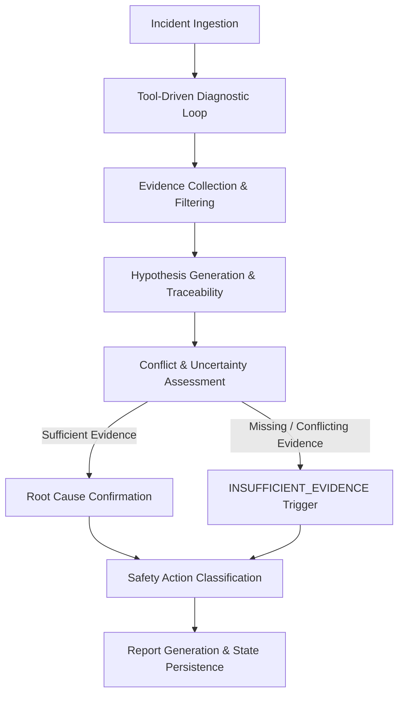

# Agent Workflow Specification

## Overview
The AI Incident Investigation Agent operates in an iterative, tool-driven loop. The agent evaluates incident symptoms, collects evidence via read-only tools, formulates and ranks hypotheses, checks for conflicting evidence, and produces an evidence-based report.

---

## Workflow Phases

### Phase 1: Diagnostic Planning & Tool Invocation
1. Reads initial incident brief (service name, start time, error symptoms).
2. Queries `get_service_metadata` to retrieve architecture bounds, database connection pool limits, and dependencies.
3. Queries `get_deployment_events` to check for recent code or configuration changes.
4. Queries `search_logs` within the incident timeframe to gather system logs and error codes.
5. Queries `get_runbook` to retrieve recommended troubleshooting steps for matching symptoms.

### Phase 2: Evidence Processing & Traceability
1. Standardizes log records and event payloads into structured `EvidenceItem` models.
2. Assigns a unique `evidence_id` (`EVD-001`, `EVD-002`, etc.) and records `timestamp_collected` and `relevance`.

### Phase 3: Hypothesis Formulation & Evidence Linkage
1. Generates candidate hypotheses (`H-001`, `H-002`).
2. Attaches `supporting_evidence_ids` to each hypothesis.
3. Attaches `contradicting_evidence_ids` to disproven or conflicting hypotheses.
4. Computes confidence score (`0.0` to `1.0`) based on supporting vs contradicting evidence ratio.

### Phase 4: Conflict Resolution & Uncertainty Rule
- If a top hypothesis reaches `confidence >= 0.85` with zero unaddressed contradictions, `conclusion_type` becomes `ROOT_CAUSE_IDENTIFIED`.
- If two hypotheses have close confidence (`delta <= 0.20`) or evidence is truncated/missing, `conclusion_type` becomes **`INSUFFICIENT_EVIDENCE`**. Missing items are logged in `open_questions`.

### Phase 5: Safety Classification & Report Compilation
1. Recommends operational actions.
2. Filters actions through `classify_action`: flags `HIGH_RISK_OPERATIONAL` and `DESTRUCTIVE` actions with `requires_approval = True`.
3. Verifies agent output against `check_execution_claim` to prevent false claims of production action execution.
4. Renders structured JSON report.
